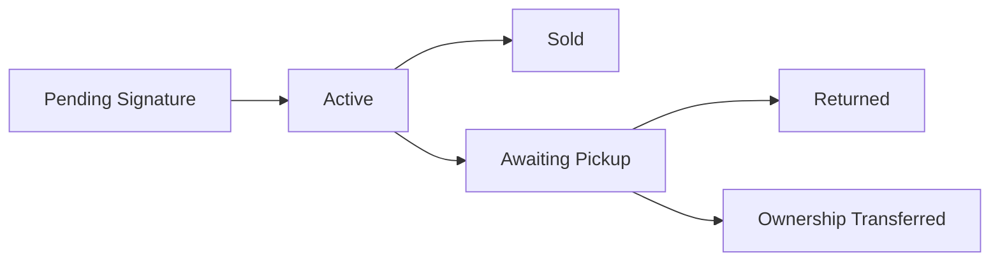

### Consignment Store

A Frappe/ERPNext app for managing consignment inventory with proper accounting, digital contracts, and automated ownership transfer.

### Quick Start with Docker (Recommended)

The fastest way to get started is using Docker. This will set up a complete development environment with ERPNext and the Consignment Store app.

**Prerequisites:**
- Docker and Docker Compose installed
- At least 4GB RAM available

**Setup:**

```bash
# Clone the repository
git clone <repository-url>
cd erpnext_consignment_store

# Copy environment variables
cp .env.example .env

# Run the automated setup (this will take 10-15 minutes)
./setup.sh
```

Once setup is complete, access your ERPNext instance at:
- **URL:** http://localhost:8000
- **Username:** Administrator
- **Password:** admin (or what you set in `.env`)

**Common Commands:**

```bash
# Start services
make start

# Stop services
make stop

# View logs
make logs

# Access Frappe console
make console

# Run migrations
make migrate

# Clear cache
make clear-cache

# View all available commands
make help
```

### Manual Installation

You can also install this app manually using the [bench](https://github.com/frappe/bench) CLI:

```bash
cd $PATH_TO_YOUR_BENCH
bench get-app $URL_OF_THIS_REPO --branch develop
bench install-app consignment_store
```

The installation automatically:
- Creates custom fields on ERPNext doctypes
- Sets up required GL accounts (Commission Income, Consignment Payable)
- Creates Consignment item/supplier groups
- Configures the workspace


## Overview

This app enables retail stores to accept inventory on consignment without affecting balance sheet values until items are sold or ownership transfers. Only commission income is recognized as revenue, while the consignor portion remains a liability.

## Key Features

- **Zero inventory value** for consigned items until ownership transfers
- **Digital contract signing** via email links
- **Automated commission calculation** on sales
- **Ownership transfer** after contract expiry + grace period
- **QR code labels** for inventory tracking
- **Seller portal** for consignors to track items and earnings

## Custom DocTypes

### Core Documents

| DocType | Purpose |
|---------|---------|
| **Consignor** | Manages individuals/entities who consign items. Links to Supplier for accounting. |
| **Consignment Contract** | Legal agreement with terms, duration, and digital signature support. |
| **Consignment Contract Item** | Child table tracking items within a contract. |
| **Commission Entry** | Records commission earned when consigned items sell. |
| **Consignment Payout** | Processes payments to consignors for accumulated commissions. |

### Supporting Documents

| DocType | Purpose |
|---------|---------|
| **Consignment Batch** | Bulk intake of items (legacy/alternative to contracts). |
| **Consignment Batch Item** | Child table for batch intake items. |
| **Consignment Payout Item** | Child table linking commission entries to payouts. |

## ERPNext DocType Modifications

### Item
Added fields:
- `is_consignment` - Marks item as consignment
- `consignor` - Link to consignor
- `consignment_code` - Unique identifier
- `commission_rate` - Commission percentage
- `consignment_contract` - Link to contract
- `consignment_expiry_date` - Contract end date
- `ownership_transfer_date` - When ownership transfers to store
- `consignment_status` - Current status (Pending Signature → Active → Sold/Returned/Ownership Transferred)
- `qr_code_data` - Base64 QR code for labels

### Sales Invoice Item / POS Invoice Item
Added fields:
- `is_consignment` - Flag for consignment items
- `consignor` - Item owner
- `commission_rate` - Commission percentage
- `commission_amount` - Calculated commission (our revenue)
- `consignor_amount` - Amount owed to consignor (liability)

### Supplier
Added fields:
- `is_consignor` - Links suppliers who are consignors

## Workflow

### 1. Setup
```
Consignor Registration → Auto-creates linked Supplier
```

### 2. Intake Process
```
Quick Intake Page → Create Contract → Email for Digital Signature → Items Active
```

### 3. Item Lifecycle



### 4. Sales & Accounting
When items sell:
- Sales Invoice triggers commission calculation
- GL Entries:
  - DR: Cash/Receivables (full amount)
  - CR: Commission Income (our percentage)
  - CR: Consignment Payable (consignor's portion)

### 5. Contract Expiry
```
Active → Contract Expires → Grace Period (14 days) → Ownership Transfer
```
Upon ownership transfer:
- Item becomes store inventory at 30% markdown
- Stock Entry created with value
- Item moved to "Clearance" group

### 6. Payouts
```
Commission Entries accumulate → Threshold met → Payout created → Payment processed
```

## Key Accounting Principles

1. **No Balance Sheet Impact**: Consigned items have NO warehouse value until owned
2. **Revenue Recognition**: Only commission is revenue, not full sale price
3. **Liability Tracking**: Consignor portion tracked as payable liability
4. **Ownership Transfer**: Items valued at markdown rate when store takes ownership

## Pages & Tools

- **Quick Intake** (`/app/quick-intake`): Rapid item entry with contract creation
- **Seller Portal** (`/seller-portal`): Consignor dashboard for tracking items/earnings
- **Contract Signing** (`/seller-portal/sign-contract`): Digital signature interface

## Configuration

### GL Accounts Created
- **Commission Income** - Revenue account for commission
- **Consignment Payable** - Liability account for amounts owed to consignors
- **Consignment Inventory (Memo)** - Off-balance tracking account

### Default Settings
- Contract Duration: 60 days
- Grace Period: 14 days
- Markdown Rate: 30% of retail (on ownership transfer)
- Default Commission: 50% (configurable per consignor)

## Dependencies

- Frappe Framework
- ERPNext
- Python packages: `qrcode[pil]`, `python-barcode`

## Development

### Docker Architecture

The Docker setup includes the following services:

- **mariadb** - Database server
- **redis-cache** - Redis cache for Frappe
- **redis-queue** - Redis queue for background jobs
- **backend** - Main Frappe/ERPNext application server
- **frontend** - Nginx web server
- **websocket** - WebSocket server for real-time updates
- **scheduler** - Background job scheduler
- **worker-short** - Worker for short-running background jobs
- **worker-long** - Worker for long-running background jobs

### Helper Scripts

All helper scripts are located in the `docker/` directory:

- `bash.sh` - Access bash shell in the backend container
- `console.sh` - Open Frappe Python console
- `migrate.sh` - Run database migrations
- `clear-cache.sh` - Clear Frappe cache
- `logs.sh [service]` - View logs (all services or specific service)
- `rebuild-app.sh` - Rebuild the app after making changes
- `reset.sh` - Reset entire environment (WARNING: deletes all data)

### Making Changes to the App

When you make changes to the consignment_store app code:

```bash
# The app code is mounted as a volume, so changes are reflected immediately
# However, you may need to:

# 1. Clear cache
make clear-cache

# 2. Run migrations if you changed DocTypes
make migrate

# 3. Restart services if needed
make restart

# Or use the rebuild script which does all of the above
./docker/rebuild-app.sh
```

### Troubleshooting

**Services not starting:**
```bash
# Check service status
docker-compose ps

# View logs
docker-compose logs -f [service-name]

# Restart specific service
docker-compose restart [service-name]
```

**Database connection issues:**
```bash
# Ensure MariaDB is healthy
docker-compose ps mariadb

# Check database logs
docker-compose logs mariadb
```

**Port already in use:**
```bash
# Change the HTTP_PORT in .env file
# Default is 8000, you can change to any available port
HTTP_PORT=8080
```

**Reset everything:**
```bash
# WARNING: This deletes all data
./docker/reset.sh

# Then run setup again
./setup.sh
```

### Contributing

This app uses `pre-commit` for code formatting and linting. Please [install pre-commit](https://pre-commit.com/#installation) and enable it for this repository:

```bash
cd apps/consignment_store
pre-commit install
```

Pre-commit is configured to use the following tools for checking and formatting your code:

- ruff
- eslint
- prettier
- pyupgrade

### License

gpl-2.0
