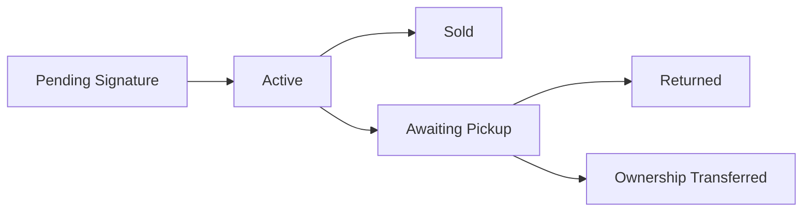

### Consignment Store

A Frappe/ERPNext app for managing consignment inventory with proper accounting, digital contracts, and automated ownership transfer.

### Installation

You can install this app using the [bench](https://github.com/frappe/bench) CLI:

```bash
cd $PATH_TO_YOUR_BENCH
bench get-app $URL_OF_THIS_REPO --branch develop
bench install-app consignment_store
```

The installation automatically:
- Creates custom fields on ERPNext doctypes
- Sets up required GL accounts (Commission Income, Consignment Payable)
- Creates Consignment item/supplier groups
- Configures the workspace


## Overview

This app enables retail stores to accept inventory on consignment without affecting balance sheet values until items are sold or ownership transfers. Only commission income is recognized as revenue, while the consignor portion remains a liability.

## Key Features

- **Zero inventory value** for consigned items until ownership transfers
- **Digital contract signing** via email links
- **Automated commission calculation** on sales
- **Ownership transfer** after contract expiry + grace period
- **QR code labels** for inventory tracking
- **Seller portal** for consignors to track items and earnings

## Custom DocTypes

### Core Documents

| DocType | Purpose |
|---------|---------|
| **Consignor** | Manages individuals/entities who consign items. Links to Supplier for accounting. |
| **Consignment Contract** | Legal agreement with terms, duration, and digital signature support. |
| **Consignment Contract Item** | Child table tracking items within a contract. |
| **Commission Entry** | Records commission earned when consigned items sell. |
| **Consignment Payout** | Processes payments to consignors for accumulated commissions. |

### Supporting Documents

| DocType | Purpose |
|---------|---------|
| **Consignment Batch** | Bulk intake of items (legacy/alternative to contracts). |
| **Consignment Batch Item** | Child table for batch intake items. |
| **Consignment Payout Item** | Child table linking commission entries to payouts. |

## ERPNext DocType Modifications

### Item
Added fields:
- `is_consignment` - Marks item as consignment
- `consignor` - Link to consignor
- `consignment_code` - Unique identifier
- `commission_rate` - Commission percentage
- `consignment_contract` - Link to contract
- `consignment_expiry_date` - Contract end date
- `ownership_transfer_date` - When ownership transfers to store
- `consignment_status` - Current status (Pending Signature → Active → Sold/Returned/Ownership Transferred)
- `qr_code_data` - Base64 QR code for labels

### Sales Invoice Item / POS Invoice Item
Added fields:
- `is_consignment` - Flag for consignment items
- `consignor` - Item owner
- `commission_rate` - Commission percentage
- `commission_amount` - Calculated commission (our revenue)
- `consignor_amount` - Amount owed to consignor (liability)

### Supplier
Added fields:
- `is_consignor` - Links suppliers who are consignors

## Workflow

### 1. Setup
```
Consignor Registration → Auto-creates linked Supplier
```

### 2. Intake Process
```
Quick Intake Page → Create Contract → Email for Digital Signature → Items Active
```

### 3. Item Lifecycle



### 4. Sales & Accounting
When items sell:
- Sales Invoice triggers commission calculation
- GL Entries:
  - DR: Cash/Receivables (full amount)
  - CR: Commission Income (our percentage)
  - CR: Consignment Payable (consignor's portion)

### 5. Contract Expiry
```
Active → Contract Expires → Grace Period (14 days) → Ownership Transfer
```
Upon ownership transfer:
- Item becomes store inventory at 30% markdown
- Stock Entry created with value
- Item moved to "Clearance" group

### 6. Payouts
```
Commission Entries accumulate → Threshold met → Payout created → Payment processed
```

## Key Accounting Principles

1. **No Balance Sheet Impact**: Consigned items have NO warehouse value until owned
2. **Revenue Recognition**: Only commission is revenue, not full sale price
3. **Liability Tracking**: Consignor portion tracked as payable liability
4. **Ownership Transfer**: Items valued at markdown rate when store takes ownership

## Pages & Tools

- **Quick Intake** (`/app/quick-intake`): Rapid item entry with contract creation
- **Seller Portal** (`/seller-portal`): Consignor dashboard for tracking items/earnings
- **Contract Signing** (`/seller-portal/sign-contract`): Digital signature interface

## Configuration

### GL Accounts Created
- **Commission Income** - Revenue account for commission
- **Consignment Payable** - Liability account for amounts owed to consignors
- **Consignment Inventory (Memo)** - Off-balance tracking account

### Default Settings
- Contract Duration: 60 days
- Grace Period: 14 days
- Markdown Rate: 30% of retail (on ownership transfer)
- Default Commission: 50% (configurable per consignor)

## Dependencies

- Frappe Framework
- ERPNext
- Python packages: `qrcode[pil]`, `python-barcode`

=======
### Setting up a dev environment

1. Create dirs
- `sudo mkdir -p /opt/shared/frappe`
- `cd /opt/shared`

2. Create frappe user and add to docker group, do not skip this.
- `sudo useradd frappe`
- `sudo usermod -aG docker frappe`
- `sudo chown -R frappe:frappe frappe`

3. Change into the user and download containers
- `sudo su frappe`
- `cd frappe`
- `git clone https://github.com/frappe/frappe_docker.git`
- `cd frappe_docker`
- `cp -R devcontainer-example .devcontainer`

4. Start Docker Daemon and go!
- `sudo systemctl start docker` (from different terminal, frappe isn't in sudoers list)
- `docker-compose -f .devcontainer/docker-compose.yml up -d` (from frappe user it is in docker group as we added it)
- `docker exec -e "TERM=xterm-256color" -w /workspace/development -it devcontainer-frappe-1 bash`
You are now in the container and can run bench commands

5. Install ERPNext + Frappe
- `sudo chown -R frappe:frappe /workspace`
- `python installer.py -n 20 -d mariadb`
- `cd frappe-bench`
- `bench use development.localhost`
- `bench start`

Congratulations you are now running an ERPNEXT development instance. Do the
install on 127.0.0.1:8000/app and create a company the consignment_store expects
a company for the postinstall. You can log in with Administrator admin

6. Clone the repo and install it
- cd into apps directory from your user that has access to your ssh key, i.e. outside the docker container
- `git clone git@github.com:0x01d/erpnext_consignment_store.git ./consignment_store`
- TODO


### Contributing

This app uses `pre-commit` for code formatting and linting. Please [install pre-commit](https://pre-commit.com/#installation) and enable it for this repository:

```bash
cd apps/consignment_store
pre-commit install
```

Pre-commit is configured to use the following tools for checking and formatting your code:

- ruff
- eslint
- prettier
- pyupgrade

### License

gpl-2.0
